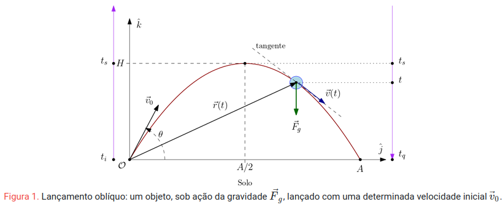

# Lançamento Oblíquo - Jogo em Unity

## Descrição

Este é um jogo desenvolvido na Unity que simula o lançamento oblíquo de projéteis, permitindo que o jogador ajuste parâmetros físicos como a massa do projétil, a velocidade de lançamento e o coeficiente de arrasto para alcançar um alvo. Cada fase apresenta desafios únicos, como diferentes ambientes (ar ou água) e propriedades físicas variadas, oferecendo um cenário dinâmico e envolvente para os jogadores.

---

## Física Aplicada ao Jogo

O jogo implementa a simulação física do **lançamento oblíquo**, baseada nas leis clássicas da mecânica de Newton.

 

Aqui estão os conceitos fundamentais aplicados:

### 1. Movimento no Campo Gravitacional

O movimento do projétil é regido pela gravidade e segue uma trajetória parabólica quando o coeficiente de arrasto é desprezado. As equações clássicas são implementadas para calcular a posição e a velocidade do projétil em tempo real:

#### **Movimento Horizontal**
A posição horizontal é descrita por:

$$
x(t) = v_0 \cdot \cos(\theta) \cdot t
$$

- $v_0$: velocidade inicial.
- $\theta$: ângulo de lançamento.
- $t$: tempo.

#### **Movimento Vertical**
A posição vertical, que inclui o efeito da gravidade, é dada por:

$$
y(t) = v_0 \cdot \sin(\theta) \cdot t - \frac{1}{2} g t^2
$$

- $g$: aceleração gravitacional ($9,81 \, m/s^2$ na Terra).

A velocidade vertical muda com o tempo devido à gravidade:

$$
v_y(t) = v_0 \cdot \sin(\theta) - g \cdot t
$$

### 2. Massa do Projétil

No jogo, o jogador pode ajustar a massa do projétil, que afeta sua aceleração conforme a segunda lei de Newton:

$$
F = m \cdot a
$$

Isso significa que projéteis mais leves podem ser lançados mais facilmente, mas são mais suscetíveis a forças externas (como arrasto), enquanto projéteis mais pesados mantêm sua inércia, mas têm trajetórias mais curtas devido à gravidade.

### 3. Coeficiente de Arrasto

Embora o jogo não calcule explicitamente a força de arrasto, ele permite ajustar um parâmetro simplificado que simula a resistência do ar ou da água. Isso afeta a desaceleração do projétil e altera a sua trajetória, proporcionando um desafio adicional nas fases que incluem obstáculos como vento ou água.

---

## Mecânicas de Jogabilidade

### **Parâmetros Ajustáveis**

1. **Velocidade Inicial ($v_0$)**: Define a força aplicada ao projétil. Jogadores podem aumentar ou diminuir a velocidade inicial para ajustar a distância que o projétil percorre.
   
2. **Ângulo de Lançamento ($\theta$)**: Afeta diretamente a trajetória parabólica. Jogadores precisam encontrar o ângulo ideal para atingir o alvo com precisão.

3. **Massa do Projétil ($m$)**: Jogadores podem experimentar com projéteis leves e pesados, ajustando sua estratégia conforme a inércia e a gravidade afetam a jogabilidade.

4. **Ambiente (Ar ou Água)**: Em fases subaquáticas, o coeficiente de arrasto simula a resistência do meio. O projétil desacelera mais rapidamente, exigindo maior precisão nos ajustes iniciais.

---

## Estratégias Baseadas na Física

Para dominar o jogo, os jogadores devem aplicar conceitos de física ao ajustar os parâmetros:

1. **Máximo Alcance Horizontal**: Para alcançar o maior alcance possível, o ângulo de lançamento deve ser próximo de $45^\circ$, em ambientes sem arrasto.

2. **Trajetória Precisa em Ambientes Resistivos**: Fases que incluem resistência do ar ou água exigem um lançamento mais direto, com ângulos menores ($<45^\circ$) para compensar a desaceleração.

3. **Controle da Massa**: Em fases com obstáculos, usar projéteis mais pesados pode ajudar a manter uma trajetória mais estável, enquanto projéteis leves são ideais para atingir alvos em áreas de difícil acesso.

---

## Tecnologias Utilizadas

- **Engine**: Unity 2023.x.
- **Linguagem**: C#.
- **Movimento de Projetéis: Física 2D**

## Autores

| Nome                                |
|:-----------------------------------:|
| Dante Brito Lourenço                |
| Frederico Scheffel Oliveira         |
| João Gabriel Pieroli da Silva       |
| Laura Fernandes Camargos            |
| Leonardo Massuhiro Sato             |
| Nicolas Amaral dos Santos           |
| Pedro Henrique de Sousa Prestes     |
| Pedro Henrique Perez Dias           |
| Pedro Lunkes Villela                |
